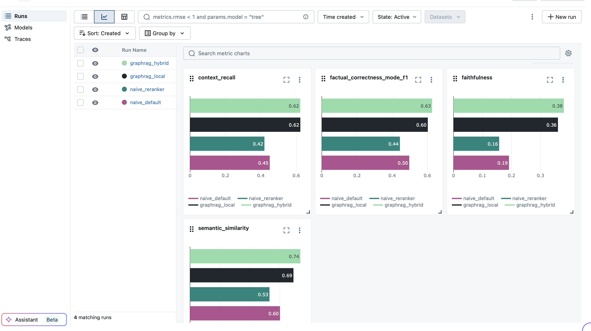

# RAG Eval Toolkit

[](https://www.python.org/downloads/)
[](https://github.com/explodinggradients/ragas)
[](https://github.com/mlflow/mlflow)

Benchmark any RAG architecture. Optimize configurations, compare approaches, and evaluate on any dataset with standardized RAGAS metrics. Experiment tracking with MLflow.




## Quick Start

```bash
# 1. Install
git clone https://github.com/emfrg/rag-eval-toolkit
cd rag-eval-toolkit
uv sync --all-extras

# Then either activate the venv:
source .venv/bin/activate
rag-eval --help

# Or prefix commands with uv run:
uv run rag-eval --help

# 2. Set API keys
cp .env.example .env
# Edit .env with your keys

# 3. Download sample dataset
uv run rag-eval dataset adapt -s yixuantt/MultiHopRAG -o data/

# 4. Run evaluation (compares reranker vs no reranker)
uv run rag-eval run -c data/corpus.jsonl -d data/questions.jsonl -C configs/naive.json -e "naive comparison" -n 20

# -n 20 = sample 20 questions for quick testing (omit for full dataset)

# Resumes automatically if interrupted. Use --recreate to start fresh.

# 5. View results
uv run mlflow ui  # Open http://127.0.0.1:5000
```

**Other pre-made configs to try:**

| Config | What it compares |
|--------|------------------|
| `configs/naive.json` | reranker vs no reranker |
| `configs/graphrag.json` | hybrid vs local query mode |
| `configs/naive_vs_graphrag.json` | all 4 configs across architectures |

> **Note:** Start with `naive.json`. GraphRAG' indexing is much slower and more expensive due to LLM-based knowledge graph construction.

---

<!--
## Demo


-->

<!--
## Sample Output

```
$ rag-eval run -c corpus.jsonl -d questions.jsonl -s naive -s graphrag

                    Experiment Results
┌─────────────┬─────────────┬────────────────┬──────────────────┐
│ Config      │ Faithfulness│ Context Recall │ Factual Correct. │
├─────────────┼─────────────┼────────────────┼──────────────────┤
│ naive_k10   │ 0.847       │ 0.723          │ 0.651            │
│ naive_k20   │ 0.812       │ 0.801          │ 0.683            │
│ graphrag    │ 0.791       │ 0.756          │ 0.702            │
└─────────────┴─────────────┴────────────────┴──────────────────┘

Best by faithfulness: naive_k10 (0.847)
```
-->


## Using Your Own Data

### Generate Questions from Your Corpus

```bash
# Generate questions from your corpus using LLM
uv run rag-eval dataset build -c corpus.jsonl -o questions.jsonl -n 50

# Generate a mix of factoid and multi-hop questions
uv run rag-eval dataset build -c corpus.jsonl -o questions.jsonl -t factoid -t multi_hop -n 100
```

### Adapt Your Data Format

```python
from rag_eval.dataset import adapt_structure

corpus, eval_dataset = adapt_structure(
    documents=[
        {"id": "1", "text": "Paris is the capital of France..."},
        {"id": "2", "text": "The Eiffel Tower was built..."},
    ],
    questions=[
        {
            "qid": "q1",
            "q": "What is the capital of France?",
            "a": "Paris",
            "sources": ["1"]
        }
    ],
    # Map your field names to ours
    document_id_field="id",
    document_content_field="text",
    question_id_field="qid",
    question_text_field="q",
    answer_field="a",
    evidence_field="sources",
)

corpus.to_jsonl("data/corpus.jsonl")
eval_dataset.to_jsonl("data/questions.jsonl")
```

### Python API

```python
from rag_eval import Corpus, EvalDataset, RAGConfig
from rag_eval.systems.config import NaiveRAGConfig, GraphRAGConfig
from rag_eval.evaluator import run_experiment

# Load data
corpus = Corpus.from_jsonl("data/corpus.jsonl")
eval_dataset = EvalDataset.from_jsonl("data/questions.jsonl")

# Define configs to compare
configs = [
    RAGConfig(
        name="naive_reranker",
        rag_type="naive",
        llm_provider="openai",
        llm_model="gpt-4o-mini",
        naive=NaiveRAGConfig(k_retrieve=10, use_reranker=True, max_docs=10),
    ),
    RAGConfig(
        name="graphrag_hybrid",
        rag_type="graphrag",
        llm_provider="openai",
        llm_model="gpt-4o-mini",
    ),
]

# Run
summary = run_experiment(configs, corpus, eval_dataset, output_dir="./results")

# View results
print(summary.results[0].scores)
# {'faithfulness': 0.847, 'context_recall': 0.723, 'factual_correctness': 0.651, ...}

# Find best config
best = summary.find_best("faithfulness")
print(f"Best: {best.config_sig} ({best.scores['faithfulness']:.3f})")

summary.print_comparison()  # Rich table output
```

---

## Plug In Your Own RAG

Implement the `RAGSystemBase` interface to benchmark your own RAG system:

```python
from rag_eval import RAGSystemBase, RAGConfig, RAGResponse, Corpus

class MyCustomRAG(RAGSystemBase):
    def create_index(self, corpus: Corpus) -> IndexReport: ...
    def load_index(self) -> None: ...
    def retrieve(self, query: str) -> list[RetrievedDocument]: ...
    def generate(self, query: str, contexts: list[str]) -> str: ...
    def query(self, question: str) -> RAGResponse: ...
```

Register and run:

```python
from rag_eval.evaluator import ExperimentRunner

runner = ExperimentRunner()
summary = runner.run_experiments(
    configs=[RAGConfig(rag_type="custom")],
    corpus=corpus,
    eval_dataset=eval_dataset,
    rag_factories={"custom": MyCustomRAG},
)
```

See [Module 2: RAG Systems](#module-2-rag-systems) for the full implementation guide.

---

<!--
## Case Study

I kept hearing that GraphRAG outperforms traditional retrieval for multi-hop questions. Testing on the MultiHopRAG dataset (`yixuantt/MultiHopRAG`), I found that an optimized naive RAG configuration — without metadata — actually matches or beats GraphRAG.

| Architecture | Faithfulness | Context Recall |
|--------------|--------------|----------------|
| Naive (k=10, reranker) | 0.847 | 0.723 |
| GraphRAG (hybrid) | 0.791 | 0.756 |

The hype didn't hold up under controlled evaluation. This doesn't mean GraphRAG is useless — but it shows that architecture choice depends on your specific data and use case.
-->


## Technical Reference

### Data Formats

The toolkit uses two core data structures. Everything else converts to these.

#### Corpus (JSONL)

A collection of documents. Each line is one document:

```jsonl
{"doc_id": "doc_1", "content": "Paris is the capital of France. It has a population of 2 million.", "metadata": {"source": "wikipedia", "category": "geography"}}
{"doc_id": "doc_2", "content": "The Eiffel Tower was completed in 1889. It is located in Paris.", "metadata": {"source": "wikipedia", "category": "landmarks"}}
{"doc_id": "doc_3", "content": "France is a country in Western Europe. Its capital is Paris.", "metadata": {"source": "textbook"}}
```

**Fields:**
- `doc_id` (required): Unique identifier
- `content` (required): The text content
- `metadata` (optional): Any additional info (source, author, date, etc.)

#### EvalDataset (JSONL)

Questions with ground truth answers. Each line is one question:

```jsonl
{"question_id": "q_1", "question": "What is the capital of France?", "answer": "Paris", "question_type": "factoid", "required_evidence": ["doc_1"], "evidence_count": 1}
{"question_id": "q_2", "question": "When was the Eiffel Tower built and where is it located?", "answer": "The Eiffel Tower was completed in 1889 and is located in Paris, France.", "question_type": "multi_hop", "required_evidence": ["doc_2", "doc_3"], "evidence_count": 2}
```

**Fields:**
- `question_id` (required): Unique identifier
- `question` (required): The question text
- `answer` (required): Ground truth answer
- `question_type`: One of `factoid`, `multi_hop`, `comparison_query`, `inference_query`, `temporal_query`
- `required_evidence`: Which doc_ids contain the answer (for context_recall metric)
- `evidence_count`: Number of documents needed to answer

### Module 1: Dataset Builder

#### Generate Questions from Corpus

When you have documents but no evaluation questions:

```python
from rag_eval.dataset import Corpus, generate_eval_dataset

corpus = Corpus.from_jsonl("data/corpus.jsonl")

eval_dataset = generate_eval_dataset(
    corpus,
    num_questions=100,           # How many to generate
    question_types=["factoid", "multi_hop"],  # Mix of types
    model="gpt-4o-mini",         # LLM for generation
    max_workers=5,               # Parallel generation
    seed=42,                     # Reproducibility
)

eval_dataset.to_jsonl("data/questions.jsonl")
```

**Question types:**
- `factoid`: Single fact lookup ("What year was X founded?")
- `multi_hop`: Requires connecting multiple docs ("What's the relationship between X and Y?")

#### Score and Filter Questions

Not all generated questions are good. Score them by quality:

```python
from rag_eval.dataset import score_eval_dataset, Corpus, EvalDataset

corpus = Corpus.from_jsonl("data/corpus.jsonl")
eval_dataset = EvalDataset.from_jsonl("data/questions.jsonl")

# Score and filter
filtered, scores = score_eval_dataset(
    eval_dataset,
    corpus=corpus,           # Needed for groundedness scoring
    model="gpt-4o-mini",
    groundedness_min=4,      # Can question be answered from context?
    relevance_min=4,         # Is question practically useful?
    standalone_min=4,        # Is question clear without context?
    complexity_min=3,        # Does it require reasoning?
)

print(f"Kept {len(filtered)}/{len(eval_dataset)} questions")
filtered.to_jsonl("data/filtered_questions.jsonl")
```

#### Adapt HuggingFace Datasets

```python
from rag_eval.dataset import adapt_huggingface_dataset

# MultiHopRAG format
corpus, eval_dataset = adapt_huggingface_dataset(
    "yixuantt/MultiHopRAG",
    dataset_type="multi_hop",
    split="train",
)

# SQUAD-like format
corpus, eval_dataset = adapt_huggingface_dataset(
    "squad",
    dataset_type="qa",
    split="validation",
)
```

### Module 2: RAG Systems

#### NaiveRAGSystem

Traditional vector similarity retrieval:

```
Documents → Embed → FAISS Index
                        ↓
Query → Embed → Vector Search → Top-K docs → [Rerank] → Generate
```

**Config options:**

```python
from rag_eval.systems.config import NaiveRAGConfig

NaiveRAGConfig(
    # Chunking
    chunk_documents=False,    # Whether to chunk before indexing
    chunk_size=400,           # Tokens per chunk
    chunk_overlap=50,         # Overlap between chunks

    # Embedding
    embedding_model="text-embedding-3-small",  # OpenAI embedding

    # Retrieval
    k_retrieve=10,            # Initial retrieval count
    similarity_threshold=1.0, # Max distance threshold

    # Reranking (optional)
    use_reranker=False,       # Use BGE reranker?
    reranker_model="BAAI/bge-reranker-base",
    rerank_threshold=0.5,     # Score threshold after rerank

    # Final output
    min_docs=0,               # Minimum docs to return
    max_docs=4,               # Maximum docs to use for generation

    # Storage
    cache_dir="./rag_cache",  # Where to store index

    # Metadata
    inline_metadata=False,    # Append metadata to content?
)
```

#### GraphRAGSystem

Knowledge graph + hybrid retrieval using LightRAG:

```
Documents → Entity Extraction → Knowledge Graph
                                      ↓
Query → [Semantic Search] + [Graph Traversal] → Hybrid Results → Generate
```

**Config options:**

```python
from rag_eval.systems.config import GraphRAGConfig, GraphRAGIndexingConfig, GraphRAGQueryConfig

GraphRAGConfig(
    indexing=GraphRAGIndexingConfig(
        cache_dir="./graphrag_cache",
        max_parallel_insert=4,
        batch_size=128,
        force_reindex=False,
    ),
    query=GraphRAGQueryConfig(
        mode="hybrid",        # "semantic", "graph", or "hybrid"
        top_k=50,
    ),
)
```

**Requires:** `uv sync --all-extras` (already included if you followed installation)

#### Implementing Custom RAG

Implement the `RAGSystemBase` interface:

```python
from rag_eval import RAGSystemBase, RAGConfig, RAGResponse, Corpus
from rag_eval.systems.base import IndexReport
from rag_eval.systems.response import RetrievedDocument

class MyCustomRAG(RAGSystemBase):
    """Example: RAG with custom retrieval logic."""

    def __init__(self, config: RAGConfig):
        super().__init__(config)
        self.index = None

    def create_index(self, corpus: Corpus) -> IndexReport:
        """Build retrieval index from corpus."""
        # Your indexing logic here
        self.index = self._build_index(corpus)
        self._index_loaded = True

        return IndexReport(
            total_documents=len(corpus),
            indexed_documents=len(corpus),
            reused_existing=False,
            index_path="./my_index",
        )

    def load_index(self) -> None:
        """Load previously built index."""
        self.index = self._load_index()
        self._index_loaded = True

    def retrieve(self, query: str) -> list[RetrievedDocument]:
        """Retrieve relevant documents."""
        self.ensure_index_loaded()  # Raises if index not ready

        # Your retrieval logic
        results = self.index.search(query, k=10)

        return [
            RetrievedDocument(
                doc_id=r.id,
                content=r.text,
                score=r.score,
                metadata=r.metadata,
            )
            for r in results
        ]

    def generate(self, query: str, contexts: list[str]) -> str:
        """Generate answer from contexts."""
        prompt = self._build_prompt(query, contexts)
        return self._call_llm(prompt)

    def query(self, question: str) -> RAGResponse:
        """Full RAG pipeline."""
        docs = self.retrieve(question)
        contexts = [d.content for d in docs]
        answer = self.generate(question, contexts)

        return RAGResponse.from_documents(answer, docs)
```

**Use in experiments:**

```python
from rag_eval.evaluator import ExperimentRunner

runner = ExperimentRunner()
summary = runner.run_experiments(
    configs=[RAGConfig(rag_type="custom")],
    corpus=corpus,
    eval_dataset=eval_dataset,
    rag_factories={"custom": MyCustomRAG},  # Register your system
)
```

### Module 3: Evaluator

#### Metrics

The toolkit uses [RAGAS](https://github.com/explodinggradients/ragas) metrics:

| Metric | What it measures | Range |
|--------|-----------------|-------|
| `faithfulness` | Is the answer grounded in retrieved context? (no hallucination) | 0-1 |
| `context_recall` | Were all relevant documents retrieved? | 0-1 |
| `factual_correctness` | Is the answer factually accurate vs ground truth? | 0-1 |
| `semantic_similarity` | Semantic similarity to reference answer | 0-1 |

#### Experiment Results

```python
summary = run_experiment(configs, corpus, eval_dataset)

# Access individual results
for result in summary.results:
    print(f"Config: {result.config_sig}")
    print(f"Scores: {result.scores}")
    print(f"Full config: {result.config}")
    print()

# Find best by metric
best = summary.find_best("faithfulness")
worst = summary.find_best("faithfulness", minimize=True)

# Export
summary.save("summary.json")              # JSON file
df = summary.to_dataframe()               # Pandas DataFrame
summary.print_comparison()                # Rich console table
```

#### Output Format

Results are saved to your output directory:

```
results/
├── summary.json           # All results comparison
├── answers/
│   ├── abc123__20240101_120000.jsonl   # Answers from config abc123
│   └── def456__20240101_120500.jsonl   # Answers from config def456
```

**summary.json format:**

```json
{
  "corpus_name": "my_corpus",
  "dataset_name": "my_eval",
  "results": [
    {
      "config_id": 0,
      "config_sig": "abc123def4",
      "config": {
        "rag_type": "naive",
        "llm_model": "gpt-4o-mini",
        "naive": {
          "k_retrieve": 10,
          "use_reranker": true,
          "max_docs": 10
        }
      },
      "scores": {
        "faithfulness": 0.847,
        "context_recall": 0.723,
        "factual_correctness": 0.651,
        "semantic_similarity": 0.905
      },
      "answers_file": "abc123def4__20240101_120000.jsonl"
    }
  ]
}
```

### CLI Reference

```bash
# Dataset commands
uv run rag-eval dataset info <file.jsonl>              # Show dataset statistics
uv run rag-eval dataset sample <file.jsonl> -n 10 -o sample.jsonl  # Create sample
uv run rag-eval dataset build -c corpus.jsonl -o questions.jsonl -n 50  # Generate Qs
uv run rag-eval dataset adapt -s huggingface/name -o ./data/  # Adapt HF dataset
uv run rag-eval dataset score -d questions.jsonl -c corpus.jsonl -o filtered.jsonl  # Score & filter

# Run experiments
uv run rag-eval run \
  --corpus data/corpus.jsonl \
  --dataset data/questions.jsonl \
  --configs configs/naive.json \
  --output ./results/ \
  --sample 10                # optional: only run on N questions
```

### Configuration Reference

#### RAGConfig (Top-level)

```python
RAGConfig(
    name="my_config",           # Optional: used for MLflow run name
    rag_type="naive",           # "naive" | "graphrag" | "custom"
    llm_provider="openai",      # "anthropic" | "openai"
    llm_model="gpt-4o-mini",    # Model for generation
    temperature=1.0,            # Sampling temperature
    max_tokens=512,             # Max response length
    naive=NaiveRAGConfig(...),  # Config if rag_type="naive"
    graphrag=GraphRAGConfig(...), # Config if rag_type="graphrag"
)
```

**Note:** For fair comparisons, all pre-made configs use `openai/gpt-4o-mini`. GraphRAG requires OpenAI for its internal LLM (knowledge graph construction).

#### LLM Providers

**OpenAI (recommended for fair comparison):**
```python
RAGConfig(
    llm_provider="openai",
    llm_model="gpt-4o-mini",  # or gpt-4o, gpt-4-turbo, etc.
)
```

**Anthropic:**
```python
RAGConfig(
    llm_provider="anthropic",
    llm_model="claude-sonnet-4-20250514",  # or claude-3-5-haiku, etc.
)
```

#### Environment Variables

```bash
# Required
ANTHROPIC_API_KEY=sk-ant-...   # For Claude models (generation)
OPENAI_API_KEY=sk-...          # For embeddings, GPT models, question generation

# The toolkit auto-loads .env files via python-dotenv
```

---

## Project Structure

```
├── configs/                  # Pre-made experiment configs
│   ├── naive.json            # Reranker vs no reranker
│   ├── graphrag.json         # Hybrid vs local query mode
│   └── naive_vs_graphrag.json # Cross-architecture comparison
│
├── src/rag_eval/
│   ├── __init__.py           # Main exports
│   ├── cli.py                # CLI entry point (Click)
│   │
│   ├── dataset/              # Module 1: Dataset Builder
│   │   ├── corpus.py         # Corpus, Document classes
│   │   ├── eval_dataset.py   # EvalDataset, EvalQuestion classes
│   │   ├── builder.py        # generate_eval_dataset()
│   │   ├── adapter.py        # adapt_structure(), adapt_huggingface_dataset()
│   │   └── critique.py       # QACritique, score_eval_dataset()
│   │
│   ├── systems/              # Module 2: RAG Systems
│   │   ├── base.py           # RAGSystemBase protocol
│   │   ├── config.py         # RAGConfig, NaiveRAGConfig, GraphRAGConfig
│   │   ├── response.py       # RAGResponse, RetrievedDocument
│   │   ├── prompts.py        # Default prompts
│   │   └── implementations/
│   │       ├── naive.py      # NaiveRAGSystem
│   │       └── graphrag.py   # GraphRAGSystem
│   │
│   ├── evaluator/            # Module 3: Evaluator
│   │   ├── runner.py         # ExperimentRunner, run_experiment()
│   │   ├── metrics.py        # RAGEvaluator (RAGAS integration)
│   │   ├── results.py        # ExperimentResult, ExperimentSummary
│   │   └── tracking.py       # MLflow experiment tracking
│   │
│   └── reporting/            # Output formatting
│       ├── console.py        # Rich console output
│       └── json_export.py    # JSON export utilities
│
├── tests/                    # Test suite
├── .env.example              # API keys template
├── pyproject.toml
└── README.md
```
